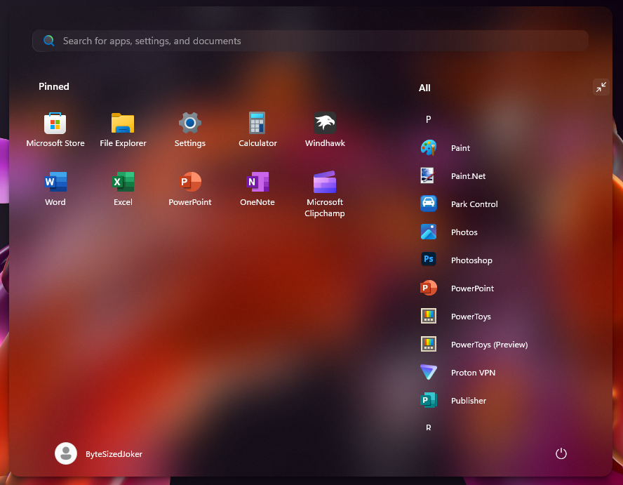

# Translucent SideBySide theme for Windows 11 Start Menu Styler

This is a fusion of **TranslucentStartMenu** and **SideBySide** themes for Windows 11 Start Menu Styler. I’ve just merged and edited code from both themes.  
**All credit goes to** [Undisputed00x](https://github.com/Undisputed00x) and [kaoshipaws](https://k4oshi.top/).



## Installation

This theme must be installed manually.

### Steps:
1. Open the **Windows 11 Start Menu Styler** mod in **Windhawk**.
2. Switch to the **"Advanced"** tab.
3. Paste the content below into the **"Mod settings"** text box.
4. Click **"Save"**.

<details>
<summary>Click to expand theme code</summary>
  
```json
{
    "controlStyles[0].target": "Grid#UndockedRoot",
    "controlStyles[0].styles[0]": "MaxWidth=700",
    "controlStyles[0].styles[1]": "Margin=0,0,300,0",
    "controlStyles[1].target": "Grid#AllAppsRoot",
    "controlStyles[1].styles[0]": "Visibility=Visible",
    "controlStyles[1].styles[1]": "MinWidth=390",
    "controlStyles[1].styles[2]": "Padding=-40,0,110,0",
    "controlStyles[1].styles[3]": "Margin=-300,0,745,1",
    "controlStyles[2].target": "Windows.UI.Xaml.Controls.Button#CloseAllAppsButton",
    "controlStyles[2].styles[0]": "Visibility=Collapsed",
    "controlStyles[3].target": "StartDocked.StartSizingFrame",
    "controlStyles[3].styles[0]": "MaxWidth=860",
    "controlStyles[3].styles[1]": "Width=860",
    "controlStyles[4].target": "Windows.UI.Xaml.Controls.Button#ShowAllAppsButton",
    "controlStyles[4].styles[0]": "Visibility=Collapsed",
    "controlStyles[5].target": "Windows.UI.Xaml.Controls.TextBlock#PinnedListHeaderText",
    "controlStyles[5].styles[0]": "Margin=-22,-5,0,0",
    "controlStyles[6].target": "Grid#TopLevelSuggestionsListHeader",
    "controlStyles[6].styles[0]": "Visibility=Collapsed",
    "controlStyles[7].target": "StartDocked.AllAppsGridListView > Windows.UI.Xaml.Controls.ScrollViewer > Border > Grid > Windows.UI.Xaml.Controls.Primitives.ScrollBar",
    "controlStyles[7].styles[0]": "Margin=-8,0,8,2",
    "controlStyles[8].target": "Microsoft.UI.Xaml.Controls.PipsPager#PinnedListPipsPager",
    "controlStyles[8].styles[0]": "Margin=-8,0,8,0",
    "controlStyles[9].target": "Windows.UI.Xaml.Controls.ItemsWrapGrid > Windows.UI.Xaml.Controls.GridViewItem",
    "controlStyles[9].styles[0]": "MaxWidth=185",
    "controlStyles[9].styles[1]": "MinWidth=85",
    "controlStyles[10].target": "StartMenu.PinnedList#StartMenuPinnedList",
    "controlStyles[10].styles[0]": "Margin=-15,0,5,0",
    "controlStyles[11].target": "Grid#ShowMoreSuggestions",
    "controlStyles[11].styles[0]": "Visibility=Collapsed",
    "controlStyles[12].target": "Grid#MoreSuggestionsRoot",
    "controlStyles[12].styles[0]": "Margin=-1,0,-4,-30",
    "controlStyles[13].target": "Windows.UI.Xaml.Controls.TextBlock#MoreSuggestionsListHeaderText",
    "controlStyles[13].styles[0]": "Margin=-40,0,0,0",
    "controlStyles[14].target": "Button#ShowMoreSuggestionsButton",
    "controlStyles[14].styles[0]": "Margin=0,-58,25,0",
    "controlStyles[15].target": "Grid#TopLevelSuggestionsContainer",
    "controlStyles[15].styles[0]": "Margin=30,-10,30,-60",
    "controlStyles[16].target": "Windows.UI.Xaml.Controls.GridViewItem",
    "controlStyles[16].styles[0]": "Margin=0",
    "controlStyles[17].target": "Border#AcrylicOverlay",
    "controlStyles[17].styles[0]": "Visibility=Collapsed",
    "controlStyles[18].target": "Windows.UI.Xaml.Controls.SemanticZoom#ZoomControl",
    "controlStyles[18].styles[0]": "IsZoomOutButtonEnabled=true",
    "controlStyles[19].target": "Windows.UI.Xaml.Controls.Button#ZoomOutButton > Windows.UI.Xaml.Controls.ContentPresenter#ContentPresenter > Windows.UI.Xaml.Controls.TextBlock",
    "controlStyles[19].styles[0]": "Text=",
    "controlStyles[20].target": "Windows.UI.Xaml.Controls.Button#ZoomOutButton",
    "controlStyles[20].styles[0]": "Width=24",
    "controlStyles[20].styles[1]": "Height=24",
    "controlStyles[20].styles[2]": "FontSize=14",
    "controlStyles[20].styles[3]": "CornerRadius=4",
    "controlStyles[20].styles[4]": "VerticalAlignment=0",
    "controlStyles[20].styles[5]": "Margin=-8,-35,8,0",
    "controlStyles[21].target": "Border#LayerBorder",
    "controlStyles[21].styles[0]": "Visibility=Collapsed",
    "controlStyles[22].target": "Windows.UI.Xaml.Controls.Grid#TopLevelSuggestionsListHeader",
    "controlStyles[22].styles[0]": "Visibility=Collapsed",
    "controlStyles[23].target": "Windows.UI.Xaml.Controls.Grid#NoTopLevelSuggestionsText",
    "controlStyles[23].styles[0]": "Height=0",
    "controlStyles[24].target": "Windows.UI.Xaml.Controls.Grid#TopLevelSuggestionsContainer",
    "controlStyles[24].styles[0]": "Height=0",
    "controlStyles[25].target": "Windows.UI.Xaml.Controls.Grid#ShowMoreSuggestions",
    "controlStyles[25].styles[0]": "RenderTransform:=<TranslateTransform Y=\"-572\" X=\"-55\" />",
    "controlStyles[26].target": "StartMenu.PinnedList",
    "controlStyles[26].styles[0]": "Height=504",
    "controlStyles[27].target": "Windows.UI.Xaml.Controls.Grid#ShowMoreSuggestions > Windows.UI.Xaml.Controls.Button > Windows.UI.Xaml.Controls.ContentPresenter > Windows.UI.Xaml.Controls.StackPanel > Windows.UI.Xaml.Controls.TextBlock",
    "controlStyles[27].styles[0]": "Text=Recommended",
    "controlStyles[28].target": "Border#AcrylicBorder",
    "controlStyles[28].styles[0]": "Background:=<AcrylicBrush TintColor=\"Black\" TintLuminosityOpacity=\"0.12\" TintOpacity=\"0\" Opacity=\"1\" FallbackColor=\"#70262626\"/>",
    "controlStyles[28].styles[1]": "BorderThickness=0",
    "controlStyles[28].styles[2]": "CornerRadius=15",
    "controlStyles[30].target": "Border#BorderElement",
    "controlStyles[30].styles[0]": "Background:=<AcrylicBrush TintLuminosityOpacity=\"0.03\" TintOpacity=\"0\" Opacity=\"1\" FallbackColor=\"#70262626\"/>",
    "controlStyles[30].styles[1]": "BorderThickness=0",
    "controlStyles[30].styles[2]": "CornerRadius=10",
    "controlStyles[32].target": "Grid#SuggestionsParentContainer",
    "controlStyles[32].styles[0]": "Visibility=Collapsed",
    "controlStyles[35].target": "MenuFlyoutPresenter",
    "controlStyles[35].styles[0]": "Background:=<AcrylicBrush TintColor=\"Black\" TintLuminosityOpacity=\"0.12\" TintOpacity=\"0\" Opacity=\"1\" FallbackColor=\"#70262626\"/>",
    "controlStyles[35].styles[1]": "BorderThickness=0",
    "controlStyles[36].target": "Border#AppBorder",
    "controlStyles[36].styles[0]": "Background:=<AcrylicBrush TintColor=\"Black\" TintLuminosityOpacity=\"0.12\" TintOpacity=\"0\" Opacity=\"1\" FallbackColor=\"#70262626\"/>",
    "controlStyles[36].styles[1]": "BorderThickness=0",
    "controlStyles[36].styles[2]": "CornerRadius=15",
    "controlStyles[37].target": "Border#AccentAppBorder",
    "controlStyles[37].styles[0]": "Background:=<AcrylicBrush TintColor=\"Black\" TintLuminosityOpacity=\"0.12\" TintOpacity=\"0\" Opacity=\"1\" FallbackColor=\"#70262626\"/>",
    "controlStyles[37].styles[1]": "BorderThickness=0",
    "controlStyles[37].styles[2]": "CornerRadius=15",
    "controlStyles[39].target": "Border#TaskbarSearchBackground",
    "controlStyles[39].styles[0]": "Background:=<AcrylicBrush TintColor=\"Transparent\" TintLuminosityOpacity=\"0.03\" TintOpacity=\"0\" Opacity=\"1\" FallbackColor=\"#70262626\"/>",
    "controlStyles[39].styles[1]": "BorderThickness=0",
    "controlStyles[39].styles[2]": "CornerRadius=10",
    "controlStyles[40].target": "Border#ContentBorder@CommonStates > Grid#DroppedFlickerWorkaroundWrapper > Border",
    "controlStyles[40].styles[0]": "Background@Normal:=<RevealBorderBrush Color=\"Transparent\" TargetTheme=\"0\" Opacity=\"0.2\"/>",
    "controlStyles[40].styles[1]": "Background@PointerOver:=<RevealBorderBrush Color=\"Transparent\" TargetTheme=\"1\" Opacity=\"0.3\"/>",
    "controlStyles[40].styles[2]": "BorderBrush@PointerOver:=<RevealBorderBrush Color=\"Transparent\" TargetTheme=\"1\" Opacity=\"1\"/>",
    "controlStyles[40].styles[3]": "Margin=1",
    "controlStyles[40].styles[4]": "Background@Pressed:=<RevealBorderBrush Color=\"Transparent\" TargetTheme=\"1\" Opacity=\"0.3\"/>",
    "controlStyles[40].styles[5]": "BorderBrush@Pressed:=<RevealBorderBrush Color=\"Transparent\" TargetTheme=\"1\" Opacity=\"1\"/>",
    "controlStyles[41].target": "Button#ShowAllAppsButton > ContentPresenter@CommonStates",
    "controlStyles[41].styles[0]": "Background@Normal:=<AcrylicBrush TintColor=\"Transparent\" TintLuminosityOpacity=\"0.05\" TintOpacity=\"1\" Opacity=\"1\" FallbackColor=\"#70262626\"/>",
    "controlStyles[41].styles[1]": "Background@PointerOver:=<RevealBorderBrush Color=\"Transparent\" TargetTheme=\"1\" Opacity=\"0.5\"/>",
    "controlStyles[41].styles[2]": "BorderBrush@PointerOver:=<RevealBorderBrush Color=\"Transparent\" TargetTheme=\"1\" Opacity=\"1\"/>",
    "controlStyles[41].styles[3]": "BorderThickness=1",
    "controlStyles[42].target": "StartDocked.SearchBoxToggleButton#StartMenuSearchBox > Grid > Border#BorderElement",
    "controlStyles[42].styles[0]": "BorderBrush:=<RevealBorderBrush Color=\"Transparent\" TargetTheme=\"1\" Opacity=\"1\"/>",
    "controlStyles[42].styles[1]": "BorderThickness=1",
    "controlStyles[43].target": "StartDocked.NavigationPaneButton#UserTileButton > Grid@CommonStates > Border",
    "controlStyles[43].styles[0]": "Background@Normal:=<RevealBorderBrush Color=\"Transparent\" TargetTheme=\"0\" Opacity=\"0.2\"/>",
    "controlStyles[43].styles[1]": "Background@PointerOver:=<RevealBorderBrush Color=\"Transparent\" TargetTheme=\"1\" Opacity=\"0.5\"/>",
    "controlStyles[43].styles[2]": "BorderBrush@PointerOver:=<RevealBorderBrush Color=\"Transparent\" TargetTheme=\"1\" Opacity=\"0.8\"/>",
    "controlStyles[43].styles[3]": "BorderThickness=1",
    "controlStyles[44].target": "StartDocked.AppListViewItem > Grid@CommonStates > Border",
    "controlStyles[44].styles[0]": "Background:=<RevealBorderBrush Color=\"Transparent\" TargetTheme=\"1\" Opacity=\"0.45\"/>",
    "controlStyles[44].styles[1]": "BorderBrush:=<RevealBorderBrush Color=\"Transparent\" TargetTheme=\"1\" Opacity=\"0.7\"/>",
    "controlStyles[44].styles[2]": "BorderThickness=1",
    "controlStyles[44].styles[3]": "Margin@Normal=4",
    "controlStyles[45].target": "StartDocked.NavigationPaneButton#PowerButton > Grid@CommonStates > Border",
    "controlStyles[45].styles[0]": "Background:=<RevealBorderBrush Color=\"Transparent\" TargetTheme=\"1\" Opacity=\"0.45\"/>",
    "controlStyles[45].styles[1]": "BorderBrush:=<RevealBorderBrush Color=\"Transparent\" TargetTheme=\"1\" Opacity=\"0.7\"/>",
    "controlStyles[45].styles[2]": "BorderThickness=1",
    "controlStyles[45].styles[3]": "Margin@Normal=4",
    "controlStyles[46].target": "ToolTip > ContentPresenter#LayoutRoot",
    "controlStyles[46].styles[0]": "Background:=<AcrylicBrush TintColor=\"Transparent\" TintOpacity=\"0\" TintLuminosityOpacity=\"0\" Opacity=\"1\" FallbackColor=\"#A0262626\"/>",
    "controlStyles[47].target": "StartDocked.AllAppsGridListViewItem > Grid@CommonStates > Border",
    "controlStyles[47].styles[0]": "BorderBrush@PointerOver:=<RevealBorderBrush Color=\"Transparent\" TargetTheme=\"1\" Opacity=\"0.8\"/>",
    "controlStyles[47].styles[1]": "Background@PointerOver:=<RevealBorderBrush Color=\"Transparent\" TargetTheme=\"1\" Opacity=\"0.55\"/>",
    "controlStyles[47].styles[2]": "BorderThickness=1",
    "controlStyles[48].target": "Button#CloseAllAppsButton > ContentPresenter@CommonStates",
    "controlStyles[48].styles[0]": "Background@Normal:=<AcrylicBrush TintColor=\"Transparent\" TintLuminosityOpacity=\"0.05\" TintOpacity=\"1\" Opacity=\"1\" FallbackColor=\"#70262626\"/>",
    "controlStyles[48].styles[1]": "Background@PointerOver:=<RevealBorderBrush Color=\"Transparent\" TargetTheme=\"1\" Opacity=\"0.5\"/>",
    "controlStyles[48].styles[2]": "BorderBrush@PointerOver:=<RevealBorderBrush Color=\"Transparent\" TargetTheme=\"1\" Opacity=\"1\"/>",
    "controlStyles[48].styles[3]": "BorderThickness=1",
    "controlStyles[49].target": "StartDocked.AllAppsZoomListViewItem > Grid@CommonStates > Border",
    "controlStyles[49].styles[0]": "Background@Normal:=<RevealBorderBrush Color=\"Transparent\" TargetTheme=\"0\" Opacity=\"0.2\"/>",
    "controlStyles[49].styles[1]": "Background@PointerOver:=<RevealBorderBrush Color=\"Transparent\" TargetTheme=\"1\" Opacity=\"0.3\"/>",
    "controlStyles[49].styles[2]": "BorderBrush@PointerOver:=<RevealBorderBrush Color=\"Transparent\" TargetTheme=\"1\" Opacity=\"0.6\"/>",
    "controlStyles[50].target": "Border#dropshadow",
    "controlStyles[50].styles[0]": "CornerRadius=16",
    "controlStyles[50].styles[1]": "Margin=-1",
    "controlStyles[51].target": "Border#DropShadow",
    "controlStyles[51].styles[0]": "CornerRadius=15",
    "controlStyles[52].target": "StartDocked.AllAppsGridListViewItem > Grid#ContentBorder@CommonStates",
    "controlStyles[52].styles[0]": "Background@PointerOver:=<AcrylicBrush TintColor=\"Transparent\" TintLuminosityOpacity=\"0.05\" TintOpacity=\"0\" Opacity=\"1\"/>",
    "controlStyles[52].styles[1]": "CornerRadius=4"
}

```
</details>
